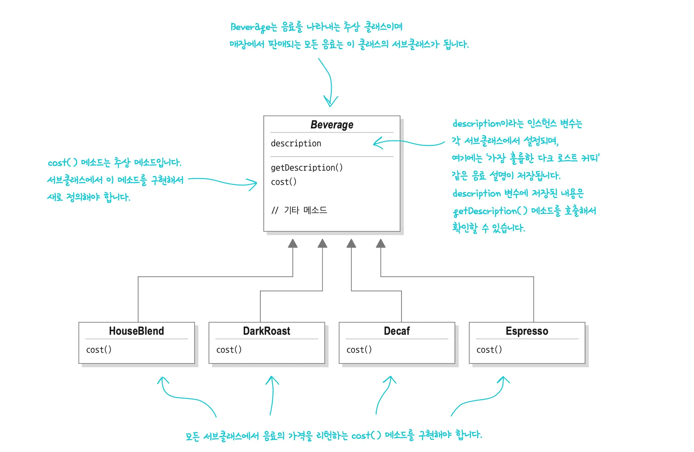
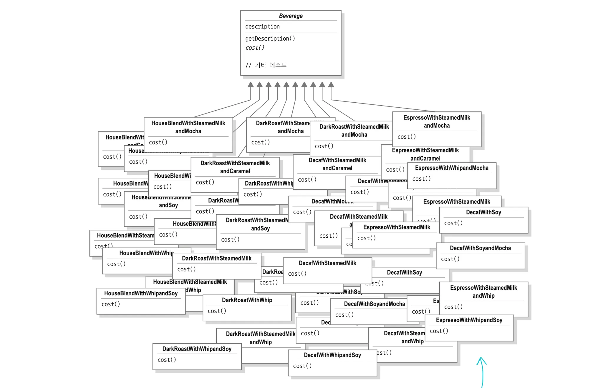

</br>
</br>

### 데코레이터 패턴은 어떤 문제점을 해결해줄까?

스타버즈라는 다양한 음료를 판매하는 커피집이 있다고 생각해봅시다.

해당 커피집은 처음 시스템을 설계할 때 음료라는 추상 클래스를 만들고, 각 음료가 이를 상속 받도록 합니다.



- `Beverage`:
    - 모든 음료의 추상 클래스로 음료 설명 속성인 `description` 속성과 가격 계산을 해주는 `cost()` 추상 메서드를 가지고 있습니다.
- `HouseBlend`, `DarkRoast`, `Decaf`, `Espresson`:
    - `Beverage` 클래스를 상속받아 `const()` 추상 메서드를 구현한 구체적인 음료 클래스입니다.

</br>
</br>

만약 이러한 시스템에서 고객들이 휘핑 크림, 두유 변경 처럼 여러 첨가물을 추가한다고 한다면 어떻게 될까요?

</br>
</br>

**상속을 통해 첨가물 구현**

가장 단순하게 생각할 수 있는 첫 번째 방법은 모든 첨가물 조합을 상속으로 구현하는 것입니다.



- 휘핑 크림을 추가하는 클래스
- 두유로 변경하는 클래스
- 원두를 다크 로스트로 변경하는 클래스
- 휘핑 크림을 추가하고 두유로 변경하는 클래스
- 휘핑 크림을 추가하고 두유로 변경하고 원두를 다크 로스트로 변경하는 클래스
- … 클래스 폭발

</br>
</br>

이러한 상속으로 구현한 디자인의 문제점은 첨가물이 4종류만 있어도 음료 종류마다 수십 개의 클래스가 필요하게됩니다. 여기서 새로운 첨가물이 하나 추가되면, 기존의 모든 클래스에 카라멜이 조합된 버전을 또 만들어야 합니다.

이렇게되면 그림처럼 클래스가 폭발하게 됩니다.

</br>
</br>

추가적으로 첨가물의 가격이 바뀐다면 해당 첨가물이 포함된 모든 클래스의 `cost()` 메서드를 찾아서 수정해야한다는 문제점이 발생합니다.

</br>
</br>

**다른 방법을 찾아보자…**

굳이 클래스를 수십 개 만들지 말고, `Beverage` 클래스에 추가, 삭제하고 싶은 첨가물들을 `boolean` 값으로 만들어서 관리하게된다면 클래스 폭발이 발생하지 않을 것입니다.

</br>
</br>


> 모든 첨가물 추가 로직이 포함된 `Beverage` 슈퍼 클래스
>

```tsx
export abstract class Beverage {
    protected description: string = "제목 없음";

    // 모든 첨가물을 슈퍼클래스에서 인스턴스 변수로 관리
    private _hasMilk: boolean = false;
    private _hasSoy: boolean = false;
    private _hasMocha: boolean = false;
    private _hasWhip: boolean = false;

    public getDescription(): string {
        return this.description;
    }

    // 첨가물 가격 계산 로직이 슈퍼클래스에 고정
    public cost(): number {
        let condimentCost = 0.0;
        if (this.hasMilk()) condimentCost += 0.10;
        if (this.hasSoy()) condimentCost += 0.15;
        if (this.hasMocha()) condimentCost += 0.20;
        if (this.hasWhip()) condimentCost += 0.10;

        return condimentCost;
    }

    // 각 인스턴스 변수를 제어하기 위한 Getter와 Setter
    public hasMilk(): boolean { return this._hasMilk; }
    public setMilk(value: boolean): void { this._hasMilk = value; }

    public hasSoy(): boolean { return this._hasSoy; }
    public setSoy(value: boolean): void { this._hasSoy = value; }

    public hasMocha(): boolean { return this._hasMocha; }
    public setMocha(value: boolean): void { this._hasMocha = value; }

    public hasWhip(): boolean { return this._hasWhip; }
    public setWhip(value: boolean): void { this._hasWhip = value; }
}
```

</br>
</br>


해당 코드 또한 여러 치명적인 문제점을 가지게 됩니다.

- **개방-폐쇄 원칙 위반:**
    - 새로운 첨가물을 추가하게되면 새로운 인스턴스 변수를 추가하고, `cost()` 메서드 내부에서 `if` 문을 추가 수정해야 합니다.
    - 첨가물 가격이 바뀌게된다면 `cost()` 메서드를 찾아서 가격을 수정해야합니다.
    - 기능을 확장하기 위해 기존 코드를 수정해야만 하는 구조로 OCP 원칙을 위반하게 됩니다.

</br>

- **유연성 및 확장성 문제:**
    - 같은 첨가물을 여러 번 추가하고 싶어도 `boolean` 값이기 때문에 추가할 수가 없습니다.
    - 새로운 음료 클래스를 만든다면, 해당 클래스는 불필요한 메서드와 속성을 상속받게 됩니다.

</br>

- **단일 역할 원칙 위반:**
    - `Beverage` 클래스는 모든 음료의 공통 부모 역할과 모든 첨가물의 가격을 관리하는 2가지 역할을 하게됩니다.
    - 첨가물 가격이 바뀔때 마다 수정되어야 하므로 SRP 원칙을 위반하게 됩니다.

</br>
</br>

해당 방식은 클래스 폭발은 막아주었지만, OCP 원칙과 SRP 원칙을 위반하여 새로운 변경이 발생할 때마다 기존 코드를 계속 수정해야 하는 경직되고 유지보수가 어려운 방식입니다.

데코레이터 패턴은 OCP와 SRP를 준수하며 해당 문제를 해결합니다.

</br>
</br>

### 데코레이터 패턴이란?

객체들을 새로운 행동들을 포함한 특수 래퍼 객체들 내에 넣어서 행동들을 해당 객체들에 연결시키는 구조적 디자인 패턴입니다.

기능을 마치 장식처럼 계속 추가하여 기능을 실행 중에 동적으로 변경 또는 확장 가능합니다.

데코레이터 패턴을 사용하면 서브클래스를 만들 때보다 훨씬 유연하게 기능을 확장할 수 있습니다.

</br>
</br>

**상속과 구성의 조합**

데코레이터 패턴은 상속 (IS-A)와 구성 (HAS-A)를 동시에 사용합니다.

두 가지를 조합하는 것이 데코레이터 패턴의 핵심이라고 할 수 있습니다.

- **상속 (IS-A 관계)**:
    - 데코레이터와 원본의 타입을 일치시키기 위해 사용합니다.
- **구성 (HAS-A 관계)**:
    - 원본 객체를 데코레이터 내부에 감싸기 위해 사용합니다.

</br>
</br>

**IS-A 관계**

IS-A 관계는 상속 `extends` 또는 인터페이스 구현 `implements` 를 통해 부모 타입과 동일한 계층에 속하게 되는 관계입니다.

</br>
</br>

**데코레이터 패턴에서 IS-A의 관계**

IS-A 관계의 가장 큰 목적은 타입을 일치시켜, 부모 타입이 필요한 곳에 자식 타입을 대신 사용할 수 있게 하여 다형성을 보장합니다.

클라이언트 코드가 객체의 실제 구체적인 타입이 무엇이든 상관없이, 공통 부모 타입 하나만 알고 상호작용할 수 있게 해줍니다.

</br>

```tsx
// 모든 객체가 공유할 공통 타입
interface Beverage {
	cost(): number;
}

// 원본 객체
// Espresson IS A Beverage
class Espresso implements Beverage {
	public cost(): number {
		return 1.99;
	}
}

// 데코레이터
// Mocha IS A Beverage
class Mocha implements Beverage {

  // ...
  
	public cost(): number {
		// ...
		return 0.20;
	}
}
```

데코레이터 패턴에서는 원본 객체인 커피와 데코레이터인 첨가물이 모두 동일한 부모 타입을 상속 받습니다.

</br>
</br>

**왜 IS-A 관계가 필요한가요?**

데코레이터를 겹쳐서 감쌀 수 있게 해주는 핵심입니다.

그러므로 클라이언트는 `Beverage` 타입만 다루면 됩니다.

```tsx
let myCoffee: Beverage;

myCoffee = new Espresso();

myCoffee = new Mocha();
```

`Mocha` 데코레이터가 `Beverage` 타입을 상속 하지 않았다면, `Beverage` 타입의 객체를 감쌀 수 없습니다.

</br>
</br>

**HAS-A 관계**

HAS-A 관계는 구성을 의미하는 관계로 한 객체가 다른 객체를 내부 속성으로 가지고 포함하는 구조입니다.

</br>
</br>

**데코레이터 패턴에서의 HAS-A 관계**

데코레이터는 자신이 감싸려는 원본 객체 또는 다른 데코레이터를 내부 필드로 저장합니다.

</br>

```tsx
// Mocha IS A Beverage
class Mocha implements Beverage {

	  // HAS-A 관계
	  // Mocha 클래스는 내부에 또 다른 Beverage 객체를 가짐
	  protected beverage: Beverage;
	  
	  // 생성자에서 감쌀 객체를 받아서 저장
	  constructor(beverage: Beverage) {
		  this.beverage = beverage;
		}
		

	public cost(): number {
		// this.beverage 에게 원래의 작업을 시킴
		const originalCost = this.beverage.cost();
		// 결과를 데코레이트
		return 0.20 + originalCost;
	}
}
```

</br>
</br>

**왜 HAS-A 관계가 필요한가요?**

HAS-A 관계를 이용하여 데코레이터가 기능을 확장하는 방식으로 사용하기 때문입니다.

</br>

위 코드를 보면 `Mocha`의 `cost()` 메서드는 `0.20` 만 반환하지 않습니다.

먼저, 자신이 가지고 있는 객체의 `cost()` 메서드를 호출합니다.

만약 가지고 있는 객체가 `Espresso` 객체라면, `Espresso` 의 `cost()` 메서드가 호출되어 `1.99`가 반환됩니다.

`Mocha` 는 해당 `1.99`에 자신의 가격을 더하여 새로운 가격을 반환합니다.

</br>

여기서 가지고 있는 객체에게 일을 위임하는 방식이 바로 HAS-A 관계가 하는 일입니다.

</br>
</br>

**정리하자면**

IS-A 상속관계는 데코레이터와 원본이 같은 타입이 되게 하여, 데코레이터를 원본 대신 사용하거나 다른 데코레이터로 또 감싸 중첩이 가능하게 해줍니다.

HAS-A 구성 관계는 데코레이터가 원본 객체를 속성으로 가지게 하여, 원본의 원래 기능을  호출하고 거기에 자신의 기능을 덧붙일 수 있게 해줍니다.

해당 예시에서는 `cost()` 메서드가 원래 기능이고 기능은 가격 추가를 나타냅니다.

</br>
</br>

### **데코레이터 패턴의 적용**

데코레이터 패턴의 핵심 구성요소는 아니지만 데코레이터의 상태에 따라 다른 결과를 반환해야 하므로 상태를 정의해줍니다.

```tsx
export type Size = "TALL" | "GRANDE" | "VENTI";

export const DEFAULT_SIZE: Size = "TALL";
```

세 개의 사이즈를 새로운 타입으로 정의합니다.

기본 사이즈는 `TALL` 로 정의합니다.

</br>
</br>

`description` 과 `size` 라는 공통 속성 및 관련 메서드를 가지는 추상 클래스를 정의합니다.

모든 음료와 모든 첨가물이 동일한 타입으로 취급될 수 있도록 공통의 틀을 제공합니다.

데코레이터와 실제 객체가 모두 해당 `Beverage` 타입을 상속받기 때문에, 클라이언트는 동일한 방식으로 다룰 수 있습니다.

```tsx
import {DEFAULT_SIZE, Size} from "../Size";

// 추상 클래스로 description과 size라는 공통 속성 및 관련 메소드를 가짐
export abstract class Beverage {
    protected description: string = "제목 없음";
    size: Size = DEFAULT_SIZE;

    // 모든 자식 클래스가 공통으로 사용하는 메소드
    public getDescription(): string {
        return this.description;
    }

    public setSize(size: Size): void {
        this.size = size;
    }

    public getSize(): Size {
        return this.size;
    }

    // 자식 클래스가 반드시 직접 구현해야 하는 추상 메소드
    public abstract cost(): number;
}
```

해당 클래스를 상속받는 자식 클래스가 반드시 `cost()` 메서드를 직접 구현하도록 강제합니다.

</br>
</br>

감싸기의 대상, 장식이 될 핵심 객체, 즉 원본 객체가 필요합니다.

`Beverage` 추상 클래스를 상속받아 실제 음료 객체를 구현합니다.

```tsx
// 데코레이터로 감싸질 실제 원본 객체
import {Beverage} from "./Beverage";

// 실제 다크 로스팅 객체
export class DarkRoast extends Beverage {
    constructor() {
        super();
        this.description = "다크 로스팅 커피";
    }

    public cost(): number {
        return 0.99;
    }
}

// 실제 하우스 블렌드 객체
export class HouseBlend extends Beverage {
    constructor() {
        super();
        this.description = "하우스 블렌드 커피";
    }

    public cost(): number {
        return 0.89;
    }
}

// 실제 에스프레소 객체
export class Espresso extends Beverage {
    constructor() {
        super();
        this.description = "에스프레소 커피";
    }

    public cost(): number {
        return 1.99;
    }
}
```

`Beverage` 추상 클래스를 상속받아 실제 음료 객체를 구현합니다.

각 클래스는 생성자에게 자신의 `description` 을 설정하고, `cost()` 메서드를 구현합니다.

</br>
</br>

모든 데코레이터가 가져야 할 공통 기능과 구조를 정의하는 추상 클래스를 구현합니다.

해당 클래스는 `Beverage` 를 상속받는 동시에, `beverage` 라는 속성으로 또 다른 `Beverage` 객체를 가집니다.

```tsx
// 모든 데코레이터의 공통 부모가 되는 추상 클래스
import {Beverage} from "../components/Beverage";
import {Size} from "../Size";

// IS-A 관계
export abstract class CondimentDecorator extends Beverage {
    protected beverage: Beverage;

		// HAS-A 관계
    protected constructor(beverage: Beverage) {
        super();
        this.beverage = beverage;
    }

    public abstract getDescription(): string;

    public getSize(): Size {
        return this.beverage.getSize();
    }
}
```

`size` 속성을 데코레이터가 직접 갖는 것이 아니라, 자신이 감싸고 있는 객체에게 위임하여 반환합니다.

데코레이터는 추가 기능만 책임지고, 원본 객체가 가지고 있는 속성 `getSize` 는 원본 객채가 책임져야 하기 때문입니다.

→ 데코레이터의 목적은 핵심 구조를 건들지 않고 기능만 확장

</br>
</br>


추상 데코레이터 클래스를 상속 받는 실제 첨가물 클래스로 구체적인 데코레이터 역할을 정의합니다.

음료에 동적으로 추가할 실제 기능 또는 책임을 구현합니다.

```tsx
// CondimentDecorator를 상속받는 실제 첨가물 클래스
// 음료에 동적으로 추가할 실제 기능 또는 책임을 구현합니다.
import {CondimentDecorator} from "./CondimentDecorator";
import {Beverage} from "../components/Beverage";

// Mocha 첨가물
export class Mocha extends CondimentDecorator {
    constructor(beverage: Beverage) {
		    // 감쌀 객체를 부모 생성자로 전달합니다.
        super(beverage);
    }

		// 감싸고 있는 객체의 설명을 가져와 자신의 설명을 추가합니다.
    public getDescription(): string {
        return this.beverage.getDescription() + ", Mocha";
    }

		// 마찬가지로 감싸고 있는 객체의 가격을 가져와 자신의 가격을 추가합니다.
		// 책임을 동적으로 추가하는 핵심 로직입니다.
    public cost(): number {
        let cost = this.beverage.cost();
        const size = this.getSize();

        if (size === "TALL") {
            cost += 0.2;
        } else if (size === "GRANDE") {
            cost += 0.25;
        } else if (size === "VENTI") {
            cost += 0.3;
        }

        return cost;
    }
}

// Whip 첨가물
export class Whip extends CondimentDecorator {
    constructor(beverage: Beverage) {
        super(beverage);
    }

    public getDescription(): string {
        return this.beverage.getDescription() + ", Whip";
    }

    public cost(): number {
        let cost = this.beverage.cost();
        const size = this.getSize();

        if (size === "TALL") {
            cost += 0.1;
        } else if (size === "GRANDE") {
            cost += 0.15;
        } else if (size === "VENTI") {
            cost += 0.2;
        }
        return cost;
    }
}

// Soy 첨가물
export class Soy extends CondimentDecorator {
    constructor(beverage: Beverage) {
        super(beverage);
    }

    public getDescription(): string {
        return this.beverage.getDescription() + ", Soy";
    }

    public cost(): number {
        let cost = this.beverage.cost();
        const size = this.getSize();

        if (size === "TALL") {
            cost += 0.15;
        } else if (size === "GRANDE") {
            cost += 0.2;
        } else if (size === "VENTI") {
            cost += 0.25;
        }
        return cost;
    }
}
```

</br>
</br>

`Beverage` 와 `Condiment` 클래스들을 조립하여 실행합니다.

```tsx
import {Beverage} from "./components/Beverage";
import {DarkRoast, Espresso, HouseBlend} from "./components/beverages";
import {Mocha, Soy, Whip} from "./decorators/condiments";

// 음료 가격을 출력하는 함수
function printBeverage(beverage: Beverage) {
    console.log(
        `주문: ${beverage.getDescription()} (${beverage.getSize()})`
    );
    console.log(`가격: $${beverage.cost().toFixed(2)}`);
}

// 에스프레소
// 클라이언트는 Beverage 타입만 알고 있으면 됩니다.
// 객체가 데코레이터로 감싸져 있는지, 원본인지 신경 쓰지 않습니다.
let beverage1: Beverage = new Espresso();
printBeverage(beverage1);

// 더블 모카, 휘핑 크림을 추가한 벤티 사이즈 다크 로스트
let beverage2: Beverage = new DarkRoast();
beverage2.setSize("VENTI");
// Mocha 또한 Beverage 타입이므로 beverage2 변수에 다시 할당할 수 있습니다.
// 그렇기에 같은 첨가물을 여러번 추가할 수 있습니다.
beverage2 = new Mocha(beverage2);
beverage2 = new Mocha(beverage2);
// Mocha가 두 번 추가된 객체를 다시 감싸 휘핑 크림을 추가합니다.
beverage2 = new Whip(beverage2);
printBeverage(beverage2);

// 두유, 모카, 휘핑 크림을 추가한 그란데 사이즈 하우스 블랜드
let beverage3: Beverage = new HouseBlend();
beverage3.setSize("GRANDE");
beverage3 = new Soy(beverage3);
beverage3 = new Mocha(beverage3);
beverage3 = new Whip(beverage3);
printBeverage(beverage3);

```

</br>
</br>

**데코레이터 패턴을 적용하며 알아본 장점과 단점**

**장점**

- **OCP 원칙 준수**:
    - 만약 새로운 첨가물을 추가한다면 기존의 객체들이 들어있는 클래스의 코드를 수정할 필요가 없습니다.
      이는 변경에는 닫혀있다는 OCP 원칙을 준수합니다.
    - 또 데코레이터를 구현하는 코드에 새로운 첨가물 클래스만 추가하면 되어 확장에는 열려있습니다.
- **SRP 원칙 준수**:

  데코레이터 패턴은 책임을 명확하게 분리합니다.

    - `DarkRoast` 의 책임: 오직 다크 로스트의 기본 가격만 반환합니다.
    - `Mocha` 의 책임: 오직 모카의 사이즈별 가격 계산만 합니다.
    - `Whip` 의 책임: 오직 휘핑 크림의 사이즈별 가격 계산만 합니다.
    - 책임이 한곳에 명확하게 모여있어, 가격이 바뀌어도 가격이 바뀐 해당 클래스만 수정하면 됩니다.
- **동적인 객체 조합에 따른 유연성 증가**:
    - `new Mocha` 를 두 번 했던 것처럼 데코레이터를 여러 번 감싸는 것이 가능합니다.
    - 객체를 감싸는 순서 없이 자유롭게 객체를 조립할 수 있습니다.
        - ex) `Whip` → `Soy` 랑 `Soy` → `Whip` 은 결국 같다.

</br>
</br>

**단점**

- **자잘한 클래스의 증가**:
    - 기존의 2개 였던 파일이 6개로 증가가 되었습니다.
    - 첨가물이 계속 추가가된다면 데코레이터를 구현하는 파일의 코드가 길어집니다.
- **특정 객체 타입 확인의 어려움**:
    - 객체가 겹겹이 싸여있기 때문에, 클라이언트가 원본 객체의 구체적인 타입을 확인하기가 매우 어렵거나 불가능해집니다.
- **클라이언트 코드가 복잡해집니다.**

</br>
</br>

**번외 - 클라이언트 코드에 팩토리 패턴 적용**

전에 배운 팩토리 패턴을 적용하여 클라이언트 코드가 복잡해지는 단점을 해결 할 수 있습니다.

기존 코드는 클라이언트가 모든 재료와 조립법을 알아야 합니다.

```tsx
import { DarkRoast } from "./components/beverage.items";
import { Mocha, Whip } from "./decorators/condiment.items";

// 더블 모카 휘핑 다크 로스트
let beverage = new DarkRoast();
beverage = new Mocha(beverage);
beverage = new Mocha(beverage);
beverage = new Whip(beverage);
```

</br>
</br>

**팩토리 패턴 적용**

데코레이터의 복잡한 조립을 대신 해주는 팩토리를 생성합니다.

```tsx
import { Beverage } from "./components/Beverage";
import { DarkRoast } from "./components/beverage.items";
import { Mocha, Whip } from "./decorators/condiment.items";

// 해당 팩토리가 조립을 전부 담당합니다.
export class BeverageFactory {
  create(menuName: string): Beverage {
    if (menuName === "doubleMochaWhipDarkRoast") {
      let beverage = new DarkRoast();
      beverage = new Mocha(beverage);
      beverage = new Mocha(beverage);
      beverage = new Whip(beverage);
      return beverage;
    }
    //  다른 메뉴들
  }
}
```

</br>
</br>

클라이언트는 팩토리를 이용하면 되기에 더 이상 조립 과정을 알 필요가 없습니다.

```tsx
import { BeverageFactory } from "./BeverageFactory";

const barista = new BeverageFactory();

// 클라이언트는 주문만 담당합니다.
let beverage = barista.create("doubleMochaWhipDarkRoast");
```

</br>
</br>

### **프론트엔드와 데코레이터 패턴**

초기 프론트엔드는 UI를 보여주는 역할이 중심이었지만, 최근의 프론트엔드는 다음과 같은 다양한 기능들을 한 번에 처리해야 합니다.

- 인증/인가
- 데이터 검증
- 상태 관리
- 네트워크 요청 관리
- 성능 최적화
- 로깅 및 에러 핸들링
- … 등등..

하나의 기능에 여러 부가적인 책임이 추가되기 시작되어 각 기능을 적절하게 확장하거나 조합할 수 있는 유연한 방식이 필요해졌습니다.

→ **데코레이터 패턴이 주목받기 시작**

</br>
</br>

**기존 JavaScript에서의 한계**

프론트엔드 개발이 점점 복잡해졌음에도 불구하고, 기본 JavaScript는 특정 기능에 가볍게 기능을 덧붙이는 구조가 부족했습니다.

</br>
</br>

**JavaScript 에서 흔히 사용하던 해결방식**

- **함수를 감싸는 래퍼 함수 사용**:
    - 비슷한 코드가 계속 반복되고, 중복 로직이 생깁니다.
- **클래스 메서드를 재정의**:
    - 기존 코드 구조가 쉽게 무너지고 유지보수가 어려워지게 됩니다.
- **상속을 이용한 기능 확장**:
    - 상속은 수직적인 확장만 가능하기 때문에, 조합이 어렵고 한 번 구조가 생기면 유연성이 떨어집니다.

해당 방식들은 모두 특정 기능 위에 부가 기능을 자연스럽게 붙이기 어렵습니다.

</br>
</br>

**메타프로그래밍**

이러한 문제를 해결하기 위해 등장하는 개념이 바로 메타프로그래밍입니다.

메타프로그래밍은 프로그램을 다루는 코드를 작성하여, 코드의 동작을 런타임에 수정하거나 확장할 수 있는 방식을 말합니다.

JavaScript에서는 `Reflect`, `Proxy`, `Decorators` 도구들이 메타프로그래밍을 지원하고 있습니다.

해당 도구들은 객체나 함수의 동작을 가로채고 조작할 수 있는 기반 기술을 제공합니다.

</br>
</br>

**Proxy**

프록시는 모든 동작을 가로채는 메커니즘으로 객체의 실제 동작 전, 후에 끼어들 수 있는 레이어를 제공하는 도구입니다.

- 속성 읽기, 쓰기 감시
- 메서드 호출 로깅
- API 요청 인터셉트
- 데이터 검증

객체 앞단에 하나의 레이어를 붙여 다양한 기능을 처리할 수 있습니다.

</br>

**한계**

- 특정 메서드 하나만 데코레이션하기 어렵습니다.
- 여러 부가기능을 조합하는 구조를 만들기 어렵습니다.
- 코드 전체 레벨에서 가로채기 때문에, 세밀한 제어가 어렵습니다.

Proxy는 지나치게 전역적이고 범용적이라 특정 클래스나 메서드에만 원하는 기능을 붙이기는 어려웠습니다.

</br>
</br>

**Decorator**

데코레이터를 이용하면 이러한 한계점을 해결할 수 있습니다.

데코레이터를 활용하면 아래처럼 코드 자체를 수정하지 않고 기능을 붙일 수 있습니다.

</br>

**데코레이터 패턴의 예시**

- **React의 HOC**

HOC는 컴포넌트를 인자로 받아 새로운 컴포넌트를 반환하는 패턴을 말합니다.

컴포넌트에 인증, 로깅, 데이터 주입 등 추가 기능을 붙일 수 있습니다.

```tsx
function withAuth(Component: React.ComponentType) {
  return function WrappedComponent(props: any) {
    const isLoggedIn = Boolean(localStorage.getItem("token"));

    if (!isLoggedIn) {
      return <div>로그인이 필요합니다.</div>;
    }

    return <Component {...props} />;
  };
}

function MyPage() {
  return <h1>마이페이지</h1>;
}

export default withAuth(MyPage);
```

`MyPage` 컴포넌트는 수정되지 않지만, 로그인 체크 기능이 감싸져서 사용됩니다.

</br>
</br>

- **TypeScript에서 데코레이터를 이용한 메서드 기능 확장**

TypeScript는 `@` 데코레이터 문법을 제공합니다.

메서드 데코레이터는 원본 함수를 수정하지 않고 기능을 주입할 수 있습니다.

```tsx
function LogTime(tag: string) {
  return function (
    target: any,
    propertyKey: string,
    descriptor: PropertyDescriptor
  ) {
    const original = descriptor.value;

    descriptor.value = async function (...args: any[]) {
      console.time(tag);
      const result = await original.apply(this, args);
      console.timeEnd(tag);
      return result;
    };
  };
}

class ApiClient {
  @LogTime("getUser 요청 시간")
  async getUser() {
    return fetch("/api/user").then((res) => res.json());
  }
}
```

</br>
</br>

- **`styled-components` 의 스타일 확장**

기존 컴포넌트를 래핑하여 스타일만 추가한 새 컴포넌트를 만들 수 있습니다.

```tsx
const Button = (props) => <button {...props} />;

const PrimaryButton = styled(Button)`
  background: blue;
  color: white;
`;
```

`Button` 은 건드리지 않고, `styled` 만 감싸서 기능을 확장합니다.

</br>
</br>

- **에러 처리 공통 로직**

fetchData는 그대로지만, 에러 처리 기능만 감싸서 확장할 수 있습니다.

→ 실무에서 가장 자주 쓰이는 방식입니다.

```tsx
function withErrorHandling(fn: Function) {
  return async function (...args: any[]) {
    try {
      return await fn(...args);
    } catch (err) {
      console.error("API Error:", err);
      alert("오류가 발생했습니다.");
    }
  };
}

async function fetchData() {
  return fetch("/api/data").then((r) => r.json());
}

// 데코레이터 패턴을 사용하여 기능을 덧붙임
const safeFetchData = withErrorHandling(fetchData);

safeFetchData();
```

</br>
</br>