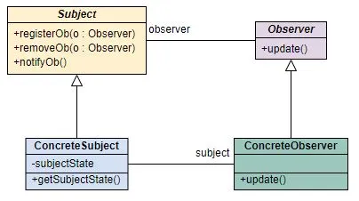
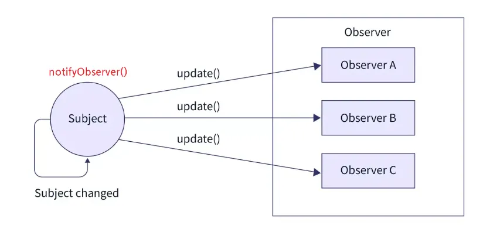
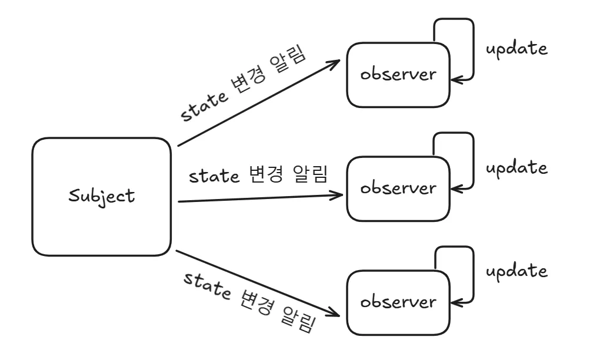

</br>
</br>

### 옵저버 패턴을 사용하기 이전

회사에서 차세대 기상 모니터링 애플리케이션을 만들어 달라는 의로가 들어왔다고 생각을 해봅시다.

이 시스템은 물리 장비로부터 데이터를 받아와, 여러 개의 디스플레이에 갱신된 정보를 보여줘야 합니다.

- **WeatherData:**
    - 기상 스테이션에서 온도, 습도, 기압 데이터를 수집하는 객체입니다.
    - `measurementsChanged()` 라는 메서드는 데이터가 갱실될 때마다 호출됩니다.
- **Display:**
    - 현재 조건, 기상 통계, 기상 예보 등 3개의 디스플레이가 존재합니다.
        - `CurrentConditions`
        - `Statistics`
        - `Forecase`
    - 데이터가 변할 때마다 실시간으로 화면을 갱신해야 합니다.

</br>
</br>

**Bad Pattern**

기상 정보를 화면에 출력하는 `Display` 클래스들입니다.

```tsx
// 현재 날씨 정보를 보여주는 디스플레이
export class CurrentConditionsDisplay {
    update(temp: number, humidity: number, pressure: number) {
        console.log(
            "[CurrentConditionsDisplay] 현재 상태: " +
            temp +
            "F, 습도 " +
            humidity +
            "%"
        );
    }
}

// 전체 평균, 최고, 최저 등을 보여주는 통계 디스플레이
export class StatisticsDisplay {
    update(temp: number, humidity: number, pressure: number) {
        console.log("[StatisticsDisplay] 통계 업데이트: temp = " + temp);
    }
}

// 기압을 기반으로 간단한 날씨 예측을 하는 디스플레이
export class ForecastDisplay {
    update(temp: number, humidity: number, pressure: number) {
        console.log("[ForecastDisplay] 기압 기반 예보 업데이트: pressure = " + pressure);
    }
}
```

</br>
</br>

`WeatherData` 클래스의 내부에서 각 디스플레이 객체를 직접 호출하여 데이터를 갱신합니다.

```tsx
// 기상 센서로부터 들어오는 데이터를 저장, 값이 바뀔 때마다 디스플레이를 직접 update로  호출
import {CurrentConditionsDisplay, ForecastDisplay, StatisticsDisplay} from "./Display";

export class WeatherData {
    // 센서로부터 전달되는 현재 기상 정보
    private temperature: number = 0;
    private humidity: number = 0;
    private pressure: number = 0;

    public currentConditionsDisplay: CurrentConditionsDisplay;
    public statisticsDisplay: StatisticsDisplay;
    public forecastDisplay: ForecastDisplay;

    // WeatherData 클래스가 직접 객체를 생성
    constructor() {
        this.currentConditionsDisplay = new CurrentConditionsDisplay();
        this.statisticsDisplay = new StatisticsDisplay();
        this.forecastDisplay = new ForecastDisplay();
    }

    // 온도를 가져오는 getter
    public getTemperature(): number {
        return this.temperature;
    }

    // 습도를 가져오는 getter
    public getHumidity(): number {
        return this.humidity;
    }

    // 기압를 가져오는 getter
    public getPressure(): number {
        return this.pressure;
    }

    // 기상 데이터가 갱신되면 호출되는 메서드
    // 현재 데이터를 가져와 각 Display 클래스의 update 메서드를 직접 호출
    public measurementsChanged(): void {
        const temp = this.getTemperature();
        const humidity = this.getHumidity();
        const pressure = this.getPressure();

        // 직접 호출 -> 강한 결합
        this.currentConditionsDisplay.update(temp, humidity, pressure);
        this.statisticsDisplay.update(temp, humidity, pressure);
        this.forecastDisplay.update(temp, humidity, pressure);
    }

    // 센서 데이터가 갱신될 때 호출되는 메서드
    public setMeasurements(temp: number, humidity: number, pressure: number) {
        this.temperature = temp;
        this.humidity = humidity;
        this.pressure = pressure;

        this.measurementsChanged();
    }
}
```

해당 코드는 구체적인 디스플레이 구현에 직접 의존하고 있어, 확장성과 유지보수 측면에서 치명적입니다.

- **OCP 원칙 위반:**
    - 체감 온도 디스플레이라는 새로운 화면을 추가하려면 `WeatherData` 코드 안에 새로운 코드를 추가해야 합니다.
    - 기능을 확장하는데 기존 코드를 수정해야하므로 OCP 원칙을 위반합니다.
- **구현체에 직접 의존하여 결합도가 높음:**
    - `WeatherData` 클래스는 세부 구현 클래스를 모두 알아야하므로 구체 클래스를 의존하고 있습니다.
    - 이는 결합도를 높여 변경에 매우 취약한 구조를 가집니다.
- **실행 중 동적 제어 불가:**
    - 프로그램 실행 중에 동적으로 디스플레이를 끄거나 켜거나 할 수 없습니다.
    - 무조건 고정된 세 디스플레이만 존재합니다.
- **코드 중복 증가 및 테스트 어려움:**
    - 디스플레이 수만큼 `update` 호출을 추가해야 합니다.
    - `WeatherData` 클래스는 변경될 때마다 테스트 범위가 커집니다.

</br>
</br>

기존 방식 즉, 옵저버 패턴을 사용하지 않는 방식은 확장은 어렵고, 변경에는 취약한 구조를 가집니다.

이 문제를 해결하기 위해 등장한 것이 옵저버 패턴입니다.

</br>
</br>
</br>
</br>

### 옵저버 패턴

옵저버 패턴은 옵저버, 관찰자들이 관찰하고 있는 대상자의 상태가 변화가 있을 때마다 대상자는 직접 목록의 각 관찰자들에게 통지하고, 관찰자들은 알림을 받아 조치를 취하는 행동 패턴입니다.

옵저버 패턴은 일대다 의존성을 가지는데, 주로 분산 이벤트 핸들링 시스템을 구현하는 데 사용됩니다.

</br>
</br>

**핵심 디자인 원칙 - 느슨한 결합**

옵저버 패턴의 핵심 목표는 `Subject` 와 `Observer` 가 서로 상호작용을 하지만, 서로에 대해 아주 조금만 알고 있는 상태를 만들어야 합니다.

- `Subject` 는 `Observer` 가 특정 인터페이스를 구현한다는 사실만 알면 됩니다.
- `Observer` 는 주제가 무슨 일을 하는지 알 필요 없이, 데이터가 바뀌었다는 신호만 받으면 됩니다.
- 그러므로 `Subject` 나 `Observer` 어느 한쪽을 수정해도 서로에게 영향을 미치지 않습니다.

</br>
</br>

→ 결과적으로 다음과 같은 이점을 가지게 됩니다.

- `Subject` 수정 없이 `Observer` 추가가 가능하여 확장성이 증가합니다.
- 서로 영향이 적어 결합도가 감소합니다.
- 실행 중 `Observer` 추가 및 해제가 가능하여 유연성이 증가합니다.

</br>
</br>
</br>
</br>

**옵저버 패턴 구조**



- **`Subject:`**
    - 주제를 나타내는 인터페이스입니다.
    - 객체에서 관찰자를 등록하거나 관찰자 목록에서 제거하고 싶을 때는 해당 인터페이스의 메서드들을 사용하면 됩니다.
- **`ConcreteSubject:` 실제 구현체**
    - 주제 역할을 하는 구상 클래스입니다.
    - `Subject` 인터페이스를 구현해야 하며, 관찰자를 등록하거나 해지할 수 있는 메서드 외에 주제의 상태가 바뀔 때마다 모든 관찰자에게 통지할 수 있는 메서드가 존재합니다.
- **`Observer:`**
    - 변경을 통보받는 관찰자 인터페이스입니다.
    - 관찰자들은 해당 인터페이스를 반드시 구현해야합니다.
    - 관찰하는 주제의 상태가 변경되면 `update` 메서드가 호출됩니다.
- **`ConcreteObserver:` 실제 구현체**
    - `Observer` 인터페이스만 구현한다면 무엇이든 관찰자가 될 수 있습니다.
    - 각 관찰자는 특정 주제 객체에 등록을 하여 객체의 변경을 통보받을 수 있습니다.
    - 변경된 정보는 `ConcreteSubject` 의 접근자를 통해 확인하거나 `update` 메서드를 통해 전달받습니다.

</br>
</br>
</br>
</br>

**옵저버 패턴 흐름**

옵저버 패턴에서는 한개의 관찰 대상자, `Subject` 와 여러개의 관찰자, `Observer` 로 일 대 다 관계로 구성되어 있습니다.

관찰 대상 `Subject` 의 상태가 바뀌면 변경사항을 `Observer` 에게 통보합니다.



대상자로부터 통보를 받은 `Observer` 는 값을 바꿀수도 있고, 삭제하는 등 적절히 대응합니다.

또한 `Observer` 들은 언제든 `Subject` 의 그룹에서 추가, 삭제 될 수 있습니다.

`Subject` 그룹에 추가되면 `Subject` 로부터 정보를 전달받게 될 것 이며, 그룹에서 삭제될 경우 더이상 `Subject` 의 정보를 받을 수 없게 됩니다.

</br>
</br>
</br>
</br>

**데이터 전달 방식 Push & Pull**

- **Push 방식 특징:**
    - `Subject` 가 `Update(temp, humidity)` 형태로 값을 그대로 밀어줍니다.
    - `Observer` 는 필요 없어도 모두 받기에 불필요한 데이터가 전달 될 수 있습니다.
    - `update` 메서드가 데이터 구조에 종속됩니다.
- **Pull 방식 특징:**
    - `Subject` 는 단순히 `update` 메서드만 호출합니다.
    - `Observer` 는 필요한 데이터만 `Subject` 에게 요청합니다.
    - 실제 라이브러리나 프레임워크 대부분 Pull 방식을 기반으로 합니다.

</br>
</br>
</br>
</br>

### 옵저버 패턴 구현

가장 먼저 모든 디스플레이가 따를 인터페이스를 구현합니다.

```tsx
// Subject와 Observer 인터페이스 정의
// 모든 디스플레이 장비는 해당 인터페이스를 구현해야함
export interface Observer {
    update(temp: number, humidity: number, pressure: number): void;
}

// 옵저버를 등록, 제거하고 알림을 보내는 역할을 함
export interface Subject {
    registerObserver(o: Observer): void; // 구독 신청
    removeObserver(o: Observer): void;   // 구독 해지
    notifyObservers(): void;             // 알림
}

// 화면에 데이터를 보여주는 인터페이스
export interface DisplayElement {
    display(): void;
}
```

</br>
</br>

`Subject` 인 `WeatherData` 를 구현합니다.

해당 클래스는 데이터를 관리하고, 데이터가 바뀌면 `Observer` 들에게 알립니다.

```tsx
// Subject 인터페이스를 구현한 실제 데이터 관리 클래스
import {Subject, Observer} from "./interfaces";

export class WeatherData implements Subject {
    // WeatherData는 구체적인 디스플레이가 아닌 Observer 인터페이스 목록만 관리
    private observers: Observer[] = [];

    private temperature: number = 0;
    private humidity: number = 0;
    private pressure: number = 0;

    public registerObserver(o: Observer): void {
        this.observers.push(o);
        console.log("✅ 옵저버가 등록되었습니다.");
    }

    public removeObserver(o: Observer): void {
        const index = this.observers.indexOf(o);
        if (index >= 0) {
            this.observers.splice(index, 1);
            console.log("❌ 옵저버가 제거되었습니다.");
        }
    }

    public notifyObservers(): void {
        for (const observer of this.observers) {
            observer.update(this.temperature, this.humidity, this.pressure);
        }
    }

    // 데이터 갱신 호출 메서드
    public measurementsChanged(): void {
        this.notifyObservers();
    }

    // 데이터 설정용 메서드
    public setMeasurements(temp: number, humidity: number, pressure: number): void {
        this.temperature = temp;
        this.humidity = humidity;
        this.pressure = pressure;

        console.log(`\n[갱신] 새로운 데이터 수신 - 온도: ${temp}, 습도: ${humidity}, 기압: ${pressure}`);
        this.measurementsChanged();
    }
}
```

해당 코드에서 `WeatherData` 는 자신을 구독하는 객체가 `CurrentDisplay` 인지 `StatisticsDisplay` 인지 전혀 알지 못 합니다.

그저 `Observer` 인터페이스를 구현한 객체들이 리스트에 있고, `update` 메서드를 호출합니다.

두 객체는 인터페이스를 통해 연결되므로 느슨한 결합을 유지합니다.

</br>
</br>

디스플레이는 `Observer` 인터페이스를 구현하여 `Subject` 로부터 데이터를 받습니다.

```tsx
// Observer 인터페이스를 구현한 구체적인 디스플레이
import {Observer, DisplayElement, Subject} from "./interfaces";

// 현재 온도와 습도를 보여주는 클래스
export class CurrentConditionsDisplay implements Observer, DisplayElement {
    private temperature: number = 0;
    private humidity: number = 0;

    private weatherData: Subject;

    constructor(weatherData: Subject) {
        this.weatherData = weatherData;
        // 객체 생성되자마자 자기 자신을 등록
        weatherData.registerObserver(this);
    }

    public update(temp: number, humidity: number, pressure: number): void {
        this.temperature = temp;
        this.humidity = humidity;
        this.display();
    }

    public display(): void {
        console.log(`>> [현재 상태] 온도: ${this.temperature}F, 습도: ${this.humidity}%`);
    }
}

// 온도의 평균, 최고, 최저 값을 계산하는 클래스
export class StatisticsDisplay implements Observer, DisplayElement {
    private maxTemp: number = 0.0;
    private minTemp: number = 200;
    private tempSum: number = 0.0;
    private numReadings: number = 0;
    private weatherData: Subject;

    constructor(weatherData: Subject) {
        this.weatherData = weatherData;
        weatherData.registerObserver(this);
    }

    public update(temp: number, humidity: number, pressure: number): void {
        this.tempSum += temp;
        this.numReadings++;

        if (temp > this.maxTemp) {
            this.maxTemp = temp;
        }

        if (temp < this.minTemp) {
            this.minTemp = temp;
        }

        this.display();
    }

    public display(): void {
        const avg = this.tempSum / this.numReadings;
        console.log(`>> [통계] 평균/최고/최저 온도 = ${avg.toFixed(1)}/${this.maxTemp}/${this.minTemp}`);
    }
}

// 기압 변화를 보고 날씨를 예측하는 클래스
export class ForecastDisplay implements Observer, DisplayElement {
    private currentPressure: number = 29.92;
    private lastPressure: number = 0;
    private weatherData: Subject;

    constructor(weatherData: Subject) {
        this.weatherData = weatherData;
        weatherData.registerObserver(this);
    }

    public update(temp: number, humidity: number, pressure: number): void {
        this.lastPressure = this.currentPressure;
        this.currentPressure = pressure;
        this.display();
    }

    public display(): void {
        let forecast = "";
        if (this.currentPressure > this.lastPressure) {
            forecast = "날씨가 좋아지고 있습니다!";
        } else if (this.currentPressure === this.lastPressure) {
            forecast = "지금과 비슷할 것 같습니다.";
        } else if (this.currentPressure < this.lastPressure) {
            forecast = "쌀쌀하며 비가 올 것 같습니다.";
        }
        console.log(`>> [예보] ${forecast}`);
    }
}
```

</br>
</br>

```tsx
import {WeatherData} from "./WeatherData";
import {CurrentConditionsDisplay, ForecastDisplay, StatisticsDisplay} from "./display";

console.log("=== 옵저버 패턴 시뮬레이션 시작 ===");

const weatherData = new WeatherData();

// 옵저버 생성 및 자동 구독
const currentDisplay = new CurrentConditionsDisplay(weatherData);
const statisticsDisplay = new StatisticsDisplay(weatherData);
const forecastDisplay = new ForecastDisplay(weatherData);

// 데이터가 변경될 때마다 모든 디스플레이가 자동으로 갱신
weatherData.setMeasurements(80, 65, 30.4);
weatherData.setMeasurements(82, 70, 29.2);
weatherData.setMeasurements(78, 90, 29.2);

// 현재 상태 디스플레이가 구독을 해지
console.log("\n--- 현재 상태 디스플레이 구독 해지 ---");
weatherData.removeObserver(currentDisplay);

// 데이터 변경
weatherData.setMeasurements(65, 50, 28.4);
```

</br>
</br>
</br>
</br>

**pull 방식을 사용한 pattern**

`Subject` 는 데이터가 바뀌었다는 사실만 알리고, `Observer` 가 필요한 데이터를 주제로부터 직접 가져옵니다.

**기존 push 방식**

```tsx
export interface Observer {
    update(temp: number, humidity: number, pressure: number): void;
}
```

`update` 메서드가 데이터를 인자로 받도록 정의됩니다.

**pull 방식**

```tsx
export interface Observer {
    update(): void;
}
```

`update` 메서드의 인자가 존재하지 않고, 변경되었다는 신호만 받습니다.

</br>
</br>

**기존 push 방식**
```tsx
public notifyObservers(): void {
        for (const observer of this.observers) {
            observer.update(this.temperature, this.humidity, this.pressure);
        }
    }
```

옵저버들에게 알림을 보낼 때, 현재 상태 데이터를 인자로 함께 보냅니다.

Push 방식에서는 `Getter` 메서드가 필수는 아닙니다

**pull 방식**
```tsx
public notifyObservers(): void {
        for (const observer of this.observers) {
            observer.update();
        }
    }
 
public getTemperature(): number {
        return this.temperature;
    }
```

`Observer` 들에게 알림을 보낼 때 데이터를 인자로 넘기지 않습니다.

옵저버가 데이터를 가져갈 수 있도록 `Getter` 메서드를 제공해야합니다.

</br>
</br>

**기존 push 방식**
```tsx
private temperature: number = 0;
private humidity: number = 0;
private weatherData: Subject;

public update(temp: number, humidity: number, pressure: number): void {
        this.temperature = temp;
        this.humidity = humidity;
        this.display();
    }
```

`WeatherData` 의 구체적인 타입을 몰라도 됩니다.

데이터가 `update` 메서드의 인자로 들어옵니다.

옵저버는 주는 대로 받아야하여 필요없는 데이터도 받아야 합니다.

**pull 방식**
```tsx
private temperature: number = 0;
private humidity: number = 0;
private weatherData: WeatherData;

public update(): void {
        this.temperature = this.weatherData.getTemperature();
        this.humidity = this.weatherData.getHumidity();
        this.display();
    }
```

`Subject` 가 아니라 구체적인 `WeatherData` 타입으로 저장합니다.

`update` 메서드가 호출되면 저장해둔 `weatherData` 참조를 통해 필요한 데이터만 가져옵니다.

pull 방식을 사용하면 나중에 데이터가 추가되어도 `Observer` 인터페이스를 수정할 필요가 없어 더 유연합니다.

</br>
</br>
</br>
</br>

**옵저버 패턴의 장점과 단점**

**장점**

- **느슨한 결합:**
    - `Subject` 는 `Observer` 의 구체 타입을 알지 못합니다.
- **OCP 원칙 준수:**
    - 새로운 `Observer` 를 추가해도 `Subject` 를 수정하지않습니다.
- **동적 확장 기능:**
    - 실행 중 `Observer` 에서 추가, 제거가 가능합니다.
- **재사용성 증가:**
    - `Subject`, `Observer` 모두 독립적으로 재사용 가능합니다.
- **다양 알림 구조로  확장 가능:**
    - Push 방식
    - Pull 방식
    - 조건부 알림

</br>

**단점**

- **많은 Observer:**
    - `Observer` 의 수가 많으면 알림 비용이 증가하여 네트워크 환경에서 이벤트 폭발 가능성이 증가합니다.
- **순환 의존성 위험:**
    - `Observer` 가 `Subject` 의 상태를 다시 변경하면 무한 루프가 발생 할 수 있습니다.
- **디버깅 어려움:**
    - 여러 `Observer` 가 동시에 반응하므로 변경 흐름이 복잡해질 수 있습니다.
- **추적 어려움:**
    - 누가 구독 중인지, 언제 구독 해제되는지 관리가 필요합니다.

</br>
</br>
</br>
</br>

### React의 상태 관리

React는 UI 라이브러리지만, 내부 동작 방식은 옵저버 패턴의 원리를 발전시킨 형태입니다.

React 상태 관리의 핵심은 상태가 변경되면 그 상태를 구독하고 있는 컴포넌트만 다시 렌더링한다라고 볼 수 있습니다.

즉, React 컴포넌트는 observer 역할을 하고, 상태는 subject 역할을 합니다.

</br>
</br>

**React가 옵저버 패턴을 사용하는 이유**

기존 웹은 DOM을 직접 조작해야 했기에 개발자의 부담이 컸습니다.

→ 모든 UI를 전체 리렌더링 한다면??

성능이 떨어지고, 불필요한 DOM 업데이트가 발생합니다.

</br>
</br>

React는 다음과 같이 문제를 해결했습니다.

각 컴포넌트가 자신이 사용하는 `state` 만 구독합니다.

해당 `state` 가 변경되면 컴포넌트만 선택적으로 리렌더링 합니다.



- **Subject:**
    - 어떤 상태를 가지고 있는 객체로 상태가 변하면 이를 감지하고, 자신을 구독한 모든 observer 에게 알림을 보냅니다.
    - React에서는 `state` 를 관리하는 주체 또는 전역 상태가 `Subject` 역할을 합니다.
- **Observer:**
    - `Subject` 가 가진 상태를 구독한 객체로 `Subject` 의 상태가 변하면 자동으로 `update` 메서드가 호출됩니다.
    - 즉, 주체의 상태 변화에 반응하는 객체입니다.
- **상태 변경 흐름:**
    - `Subject` 의 `State` 가 변경합니다.
    - 변경되었다는 알림을 `Observer` 들에게 전달합니다.
    - 각 `Observer` 는 `update` 메서드 실행합니다.

</br>
</br>
</br>
</br>