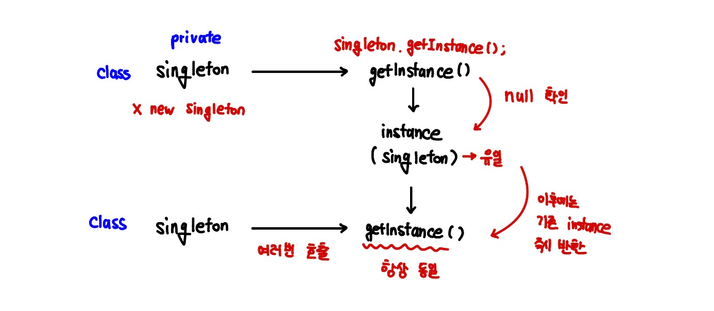

</br>
</br>

### **`instance`와 `static`**

`instance` **요소**

`new` 키워드를 통해 클래스의 객체가 생성될때마다 해당 객체에 속하게 되는 필드와 메소드를 말합니다.

- **생성 시점:** `new` 키워드를 통해 객체가 생성될때마다 새롭게 생성되고 메모리에 할당됩니다.
  즉, 객체가  생성된 수 만큼 메모리가 할당됩니다.

</br>

**`static` 요소**

인스턴스가 아닌 클래스 생성자 자체에 직접 속하는 필드와 메소드입니다.

- **생성 시점:** `new` 호출과 관계없이 단 한 번 생성되고 메모리에 할당됩니다.

</br>
</br>

### **싱글턴 패턴**

싱글턴 패턴은 생성 디자인 패턴 중 하나입니다.



클래스에 인스턴스가 단 하나만 있도록 보장하며, 해당 인스턴스에 대한 전역 접근 지점을 제공합니다.

쉽게 정리하지면 인스턴스가 필요하면 클래스에 요청할 수 있게 만들어 놓고, 요청이 들어오면 하나뿐인 인스턴스를 건네주도록 만들어야합니다.

</br>
</br>

**싱글턴 패턴을 왜 사용하는거야?**

**메모리 측면의 이점**

전역 변수에 인스턴스를 대입하면 애플리케이션이 시작될 때 인스턴스가 생성이 됩니다.

이때, 해당 인스턴스가 자원을 많이 차지한다고 가정했을때, 애플리케이션이 끝날 때까지 해당 객체를 한 번도 쓰지 않는다면 괜히 자원만 잡아먹는 쓸데없는 객체가 됩니다.

싱글턴 패턴을 사용하면 필요할 때만 인스턴스를 만들 수 있기 때문에 자원 낭비가 발생하지 않습니다.

</br>

**속도와 데이터 공유의 이점**

생성된 인스턴스를 사용할 때는 이미 생성된 인스턴스를 활용하여 속도 측면에 이점이 존재하고, 전역으로 사용하는 인스턴스이기 때문에 여러 클래스에서 데이터를 공유하며 사용 가능합니다.

</br>

**문제점은 없나요?**

**의존성**

클래스의 인스턴스를 미리 생성한 뒤, 필요한 경우에 정적 메서드를 사용하는 특징 때문에 클래스 사이에 의존성이 높아집니다.

</br>

**단일 책임 원칙을 위반**

인스턴스 개수를 하나로 제한하는 역할과 전역 접근 지점을 제공하는 역할로 총 두 가지의 역할을 수행하고 있기에, 단일 책임 원칙을 위반합니다.

</br>

**상속과 테스트의 어려움**

기본 생성자를 `private`로 만들기 때문에 상속이 어려워 객체지향의 장점을 잃게 됩니다.

또, 인스턴스끼리 자원을 공유하고 있기 때문에 단위 테스트 진행이 어렵습니다.
그렇기에 독립적인 테스트가 가능하려면 매번 인스턴스를 초기화해야합니다.

</br>
</br>

### 구현

**싱글턴 패턴의 핵심 규칙을 설정합니다.**

```tsx
static #instance: Singleton;
private constructor() {}
```

`static` 변수를 사용하여 해당 변수는 클래스 전체에서 단 하나만 존재하게 설정합니다.

생성자를 `private`으로 선언하여 `new` 키워드를  통한 인스턴스 생성을 차단합니다.

</br>
</br>

**외부에서 유일한 인스턴스를 어떻게 가져오고 사용하는지에 대한 방법을 정의합니다.**

```tsx
public static get instance(): Singleton {
		if (!Singleton.#instance) {
			Singleton.#instance = new Singleton();
		}
		
		return Singleton.#instance;
	}
	
	public someBusinessLogic() {
		// 인스턴스에서 실행될 수 있는 비즈니스 로직 ...
	}
```

외부에서 인스턴스에 접근할 수 있는 정적 게터입니다.

`new` 키워드 없이도 `Singleton.instance`라는 클래스 이름을 통해 외부 어디서든 접근이 가능합니다.

`if` 조건문을 통해 최초 호출시 유일한 인스턴스가 단 한 번 생성되어 저장이 되고, 두 번쨰 호출부터 같은 인스턴스를 `return` 합니다.

</br>
</br>

**검증을 위한 클라이언트 코드**

```tsx
function clientCode() {
	const s1 = Singleton.instance;
	const s2 = Singleton.instance;
	
	if (s1 === s2) {
		console.log("싱글턴이 작동합니다. 두 변수는 동일한 인스턴스를 포함합니다.");
	}
	else {
		console.log("싱글턴이 실패했습니다. 변수들이 서로 다른 인스턴스를 포함합니다.");
	}
}
```

`Singleton` 클래스의 `instance` 게터를 호출하여 실행합니다.

위 코드에서 처럼 두 번째 호출부터도 같은 인스턴스를 `return` 하기 때문에 조건문은 항상 `true`가 됩니다.

</br>
</br>

```tsx
// 싱글턴 클래스
class Singleton {
	static #instance: Singleton;
	private constructor() {}
	
	public static get instance(): Singleton {
		if (!Singleton.#instance) {
			Singleton.#instance = new Singleton();
		}
		
		return Singleton.#instance;
	}
	
	public someBusinessLogic() {
		// 인스턴스에서 실행될 수 있는 비즈니스 로직 ...
	}
}

// 클라이언트 코드
function clientCode() {
	const s1 = Singleton.instance;
	const s2 = Singleton.instance;
	
	if (s1 === s2) {
		console.log("싱글턴이 작동합니다. 두 변수는 동일한 인스턴스를 포함합니다.");
	}
	else {
		console.log("싱글턴이 실패했습니다. 변수들이 서로 다른 인스턴스를 포함합니다.");
	}
}

clientCode();
```

</br>
</br>