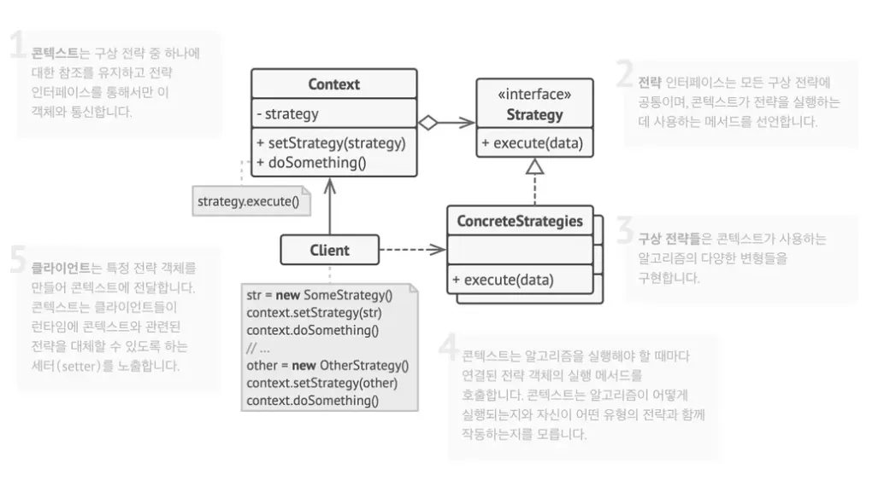

### 전략 패턴이란?

알고리즘들의 패밀리를 정의하고, 각 패밀리를 별도의 클래스에 넣은 후 그들의 객체들을 상호교환할 수 있도록 하는 행동 디자인 패턴이다.

쉽게 말해, 전략이라고 부를 수 있는 알고리즘들을 각각 부품처럼 만들어 놓고, 상황에 따라 필요한 부품을 가져다 쓰는 방식이다.

객체가 직접 알고리즘을 실행하는 것이 아니라, 전략 객체에 그 실행을 위임한다.

<br>
<br>

### 전략 패턴이 왜 필요한가?

내비게이션 앱을 예시로 설명을 진행하겠다.

<br>

앱의 첫 번째 버전에는 자동차 길찾기 기능만 있었다고 가정한다.

```tsx
class Navigator {
	findRoute(start, end, type) {
		if (type === 'car') {
			// 자동차 경로 계산 로직
		} else if (type === 'walk') {
			// 도보 경로 계산 로직
		} else if (type === 'publicTransport') {
			// 대중교통 경로 계산 로직
		}
		...
	}
}
```

이처럼 새로운 길찾기 **전략**이 추가될 때마다 기존 **`Navigator`** 클래스의 코드가 계속해서 비대해지고 복잡해진다.

이러한 코드에는 여러가지 문제점이 존재한다.

<br>
<br>

- **유지보수의 어려움**
  - 작은 버그 수정이나 로직 변경이 다른 로직에 영향을 줄 수 있다.
- **확장성의 한계**
  - 새로운 기능을 추가할 때마다 기존 코드를 직접 수정해야한다.
- **높은 결합도**
  - **`Navigator`** 클래스가 모든 경로 탐색 알고리즘을 직접 알고 있어야 하므로, 알고리즘과 클래스 간의 의존성이 높아진다.

<br>
<br>

> **그렇다면 어떻게 해결하면 좋을까?**

전략 패턴은 이러한 문제들을 해결하기 위해, 특정 작업을 다양한 방식으로 수행하는 클래스를 선택한 후 모든 알고리즘을 **`strategies`** 이라는 별도의 클래스들로 추출할 것을 제안한다.

**즉, 변화하는 부분인 알고리즘을 식별하고, 이를 별도의 클래스로 캡슐화한다.**

<br>
<br>

### 전략 패턴의 구조

전략 패턴은 크게 4가지 요소로 구성된다.


> **Context**

전략을 사용하는 주체로 앞선 예시에서는 **`Navigator`** 클래스에 해당한다.

- 내부에 교체 가능한 **`Strategy`** 인터페이스 타입의 참조 변수를 가진다.
- 자신이 직접 알고리즘을 실행하지 않고, 참조하고 있는 전략 객체에 실행을 위임한다.
- 어떤 전략이 선택되었는지는 신경 쓰지 않으며, 모든 전략을 동일한 방식으로 호출한다.

<br>

> **Strategy - 전략 인터페이스**

모든 구체적인 전략들이 구현해야 하는 공동의 약속인 메서드를 정의합니다.

- **`Context`** 는 이 인터페이스를 통해서만 구체적인 전략을 사용한다.

<br>

> **Concrete Strategies - 구체적인 전략들**

**`Strategy`** 인터페이스를 실제로 구현한 클래스들이다.

- 실질적인 알고리즘이 구현되는 부분이다.
  - ex) **`CarStrategy`**, **`WalkStrategy`**, **`TransportStrategy`** 클래스

<br>

> **Client**

어떤 전략을 사용할지 결정하고, Context 객체에 해당 전략 객체를 전달하는 역할을 한다.

- 전략들의 차이점을 알고 있고, 상황에 맞는 전략을 선택할 책임이 있다.
  - ex) 사용자가 UI에서 도보 버튼 클릭시, **Client** 는 **`WalkStrategy`** 객체를 생성하여 Context에 설정해야한다.

<br>
<br>

### 전략 패턴 적용 - Form Validation

프론트 개발에서 흔히 볼 수 있는 폼 유효성 검사에 전략 패턴을 적용을 해보겠다.

회원가입 폼에 여러 입력 필드가 있고, 각 필드마다 다른 유효성 검사 규칙(필수값, 이메일 형식, 최소 길이 등)이 필요하다.

이때, **`if else`** 문으로 모든 규칙을 검사하면 코드가 복잡해지고 새로운 규칙을 추가하기 어렵다.

회원가입 폼에 전략 패턴을 적용해보겠다.

<br>

> **Strategy 인터페이스 정의**

해당 인터페이스는 모든 유효성 검사 전략들이 따라야 할 규칙을 정의한다.

```tsx
interface ValidationStrategy {
  validate(value: string): { isValid: boolean; message: string };
}
```

strategy.ts

- 유효성 검사 전략이라면 반드시 **`validate`** 라는 이름의 메서드를 가져야한다.
- 이를 통해 **Context**는 어떤 구체적인 전략이 오더라도 항상 동일한 방식으로 **`validate`** 메서드를 호출할 수있다.

<br>

> **Concrete Strategies**

**`ValidationStrategy`** 인터페이스를 바탕으로 구체적인 유효성 검사 전략을 구현한다.

```tsx
class RequitedStrategy implements ValidationStrategy {
  public validate(value: string): { isValid: boolean; message: string } {
    const isValid = value.trim() !== "";
    return {
      isValid,
      message: isValid ? "" : "이 항목은 필수입니다.",
    };
  }
}

class EmailStrategy implements ValidationStrategy {
  // 이메일 형식 검사 로직
}

class MinLengthStrategy implements ValidationStrategy {
  private readonly minLength: number;

  constructor(minLength: number) {
    this.minLength = minLength;
  }
  // 최소 길이 검사 로직
}
```

strategies.ts

- 3개의 클래스는 **`ValidationStrategy`** 인터페이스를 실제로 구현한 구체적인 전략 부품이다.
  각 클래스는 **`validate`** 메서드 안에 자신만의 고유한 유효성 검사 알고리즘을 가지고 있다.
- **`MinLengthStrategy`** 클래스처럼 생성자를 통해 외부에서 값을 받아 전략의 세부 동작을 조절할 수도 있어, 재사용성과 유연성이 높아진다.

<br>

> **Context 구현**

**`Validator`** 클래스가 바로 **Context** 이다.

```tsx
class Validator {
  private strategy: ValidationStrategy | null = null;

  public setStrategy(strategy: ValidationStrategy): void {
    this.strategy = strategy;
  }

  public validate(value: string): { isValid: boolean; message: string } {
    if (!this.strategy) {
      throw new Error("검증 전략이 설정되지 않았습니다.");
    }
    return this.strategy.validate(value);
  }
}
```

context.ts

- **`private strategy`**
  - 현재 장착된 전략 부품을 저장하는 공간으로 **`ValidationStrategy`** 인터페이스로 타입이 지정되어 해당 규칙을 따르는 어떤 전략 객체든 담을 수 있다.
- **`setStrategy`**
  - 외부에서 전략 부품을 받아 교체하는 메서드이다.
  - 해당 메서드를 통해 런타임에 동적으로 유효성 검사 규칙을 바꿀 수 있다.
- **`validate`**
  - **`Validator`** 의 핵심 동작으로 해당 메서드는 스스로 유효성 검사를 하지 않는다.
  - 현재 장착된 **`strategy`** 객체에게 **`validate`** 작업을 위임한다.
  - **`Validator`** 는 어떤 전략이 들어있는지 몰라도, **`strategy.validate`** 를 호출하기만 한다.

<br>

> **`Client`**

해당 코드를 통해 **`Client`** 의 역할을 수행한다.

```tsx
const usernameInput = "빽다방";
const emailInput = "NiceToCu@fuck.com";
const passwordInput = "ATWOSOMEPLACE";

const validator = new Validator();

// 사용자 이름은 필수 항목 전략을 사용한다.
validator.setStrategy(new RequiredStrategy());
console.log("Username:", validator.validate(usernameInput));

// 이메일은 이메일 형식 전략을 사용한다.
validator.setStrategy(new EmailStrategy());
console.log("Email:", validator.validate(emailInput));

// 비밀번호는 최소 길이 8인 전략을 사용한다.
validator.setStrategy(new MinLengthStrategy(8));
console.log("Password:", validator.validate(passwordInput));
```

client.ts

**`validator`** 라는 **`context`** 객체를 만든다.

상황에 맞는 전략 객체를 생성하여 **`Context`** 에 주입하고 실행한다.

<br>
<br>

### 전략 패턴의 장단점

> **장점**

- **개발-폐쇄 원칙 OCP를 만족한다.**
  - 기존 **`Context`** 코드를 수정하지 않고 새로운 전략을 추가하여 기능을 확장할 수 있다.
- **상속 대신 합성을 사용한다.**
  - 상속의 단점인 강한 결합을 피하고, 런타임에 동적으로 행동을 변경할 수 있게되어 유연해진다.
- **알고리즘을 분리한다.**
  - 알고리즘의 세부 구현을 사용하는 **`Context`** 로부터 분리하여 독립적으로 관리하고 테스트할 수 있다.
- **조건문이 감소한다.**
  - **`if else`** 나 **`switch`** 같은 복잡한 조건 분기문을 깔끔하게 대체할 수 있다.

<br>

> **단점**

- **클래스와 객체 수가 증가한다.**
  - 간단한 로직에 적용할 경우, 전략마다 클래스를 만들어야 하므로 전체적인 구조가 더 복잡해 보일 수 있다.
- **클라이언트의 책임이 증가한다.**
  - 클라이언트는 여러 전략의 차이점을 이해하고, 상황에 맞는 적절한 전략을 직접 선택하여 Context에 주입해야 한다.
- **함수형 프로그래밍으로 대체가 가능하다.**
  - **JavaScript** 나 **TypeScript** 는 고차 함수를 지원하므로, 클래스를 만들지 않고 함수 자체를 전략으로 전달하여 더 간결하게 구현할 수도 있다.

<br>
<br>

### **프론트 개발에서의 또 다른 적용 사례**

- **데이터 정렬**
  - 사용자가 이름순, 가격순, 최신순 등 다양한 기준으로 목록을 정렬할 때, 각 정렬 로직을 별도의 전략으로 만들 수 있다.
- **애니메이션 효과**
  - 특정 컴포넌트에 애니메이션 효과를 적용할 때, 각 애니메이션 로직을 전략으로 분리하여 교체할 수 있다.
- **데이터 렌더링**
  - 동일한 데이터를 여러 형태로 보여줘야 할 때, 각 형태를 보여주는 로직을 렌더링 전략으로 만들 수 있다.
- **API 요청 처리**
  - 데이터를 캐시에서 먼저 가져올지, 항상 네트워크 요청을 보낼지 등 데이터 패칭 방식을 전략으로 정의할 수 있다.
